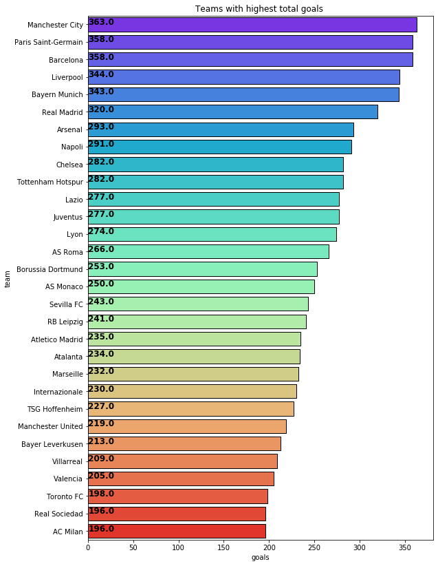

## Soccer Leagues
### Regression - Project 4

Submitted by: Mugdha Bajjuri

FIveThirtyEight recently released their newest batch of soccer power index (SPI) ratings for soccer teams around the world. This dataset contains 3 CSV files.

spi_matches.csv contains match-by-match SPI ratings and forecasts back to 2016.

spi_global_rankings.csv contains current SPI ratings and rankings for men's club teams.

spi_global_rankings_intl.csv contains current SPI ratings and rankings for men's international teams.


### Correlation between the Features


### Bar plot shows the teams with highest goals





### Bar graph shows matches played in each league


### 3D scatter plot - Show relation between number of goals by each team, global rank of the team and Matches played by the team


```python
df_final = df_final.dropna()
```


# Logistic Regression


    Accuracy of Logistic regression classifier on train set for score1: 0.73
    Accuracy of Logistic regression classifier on test set for score1: 0.73
    ------------------------------------------------------------------------------------------
    Accuracy of Logistic regression classifier on train set for score1: 0.73
    Accuracy of Logistic regression classifier on test set for score2: 0.72


We are getting approximately 73% of accuracy when Logistic regression model is applied.

### Mean Square Errors


    Mean Square Error Train team1: 0.428
    Mean Square Error Test team1: 0.402


    Mean Square Error Train team2: 0.377
    Mean Square Error Test team2: 0.379


# Linear regression


    LinearRegression -- Mean square error on train set for score1 for score1
    0.17126798746211974
    LinearRegression -- Mean square error on test set for score1 for score1
    0.1688752205975808
    ------------------------------------------------------------------------------------------
    LinearRegression -- Accuracy on train set for score1
    0.982507283255609
    LinearRegression -- Accuracy on test set for score1
    0.9819182819136011


    LinearRegression -- Mean square error on train set for score1 for score2
    0.1322271970955995
    LinearRegression -- Accuracy on train for score2
    0.9863952103628401
    ------------------------------------------------------------------------------------------
    LinearRegression -- Mean square error on test set for score1 for score2
    0.12752556335513365
    LinearRegression -- Accuracy on test set for score2
    0.9873187142614218


# Random forest


    Mean Square Error Train team1: 0.001
    Mean Square Error Test team1: 0.009


    Mean Square Error Train team2: 0.001
    Mean Square Error Test team2: 0.004


## Regression using the "Random Forest Model" performed better compared to other models


Through mean square errors we can see that random forest is performing well when compared to logistic and linear regression models.


